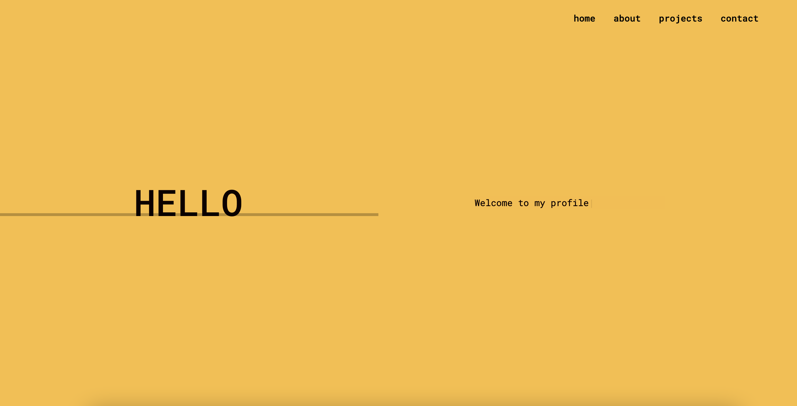
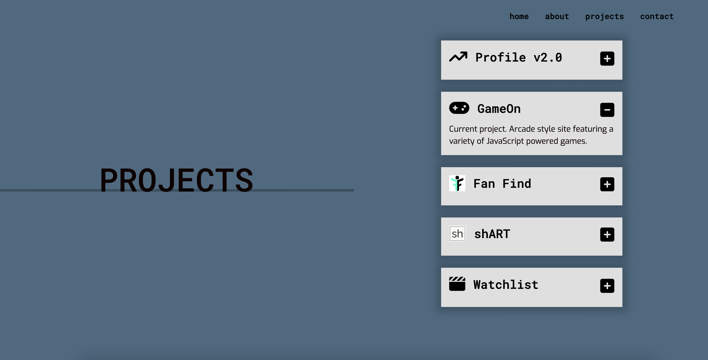
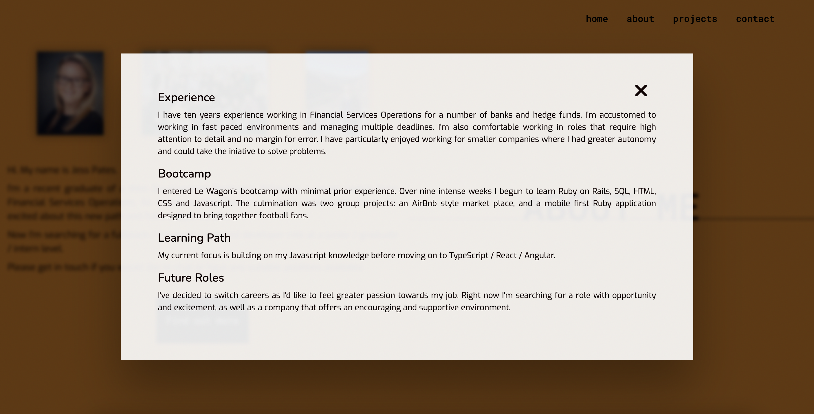
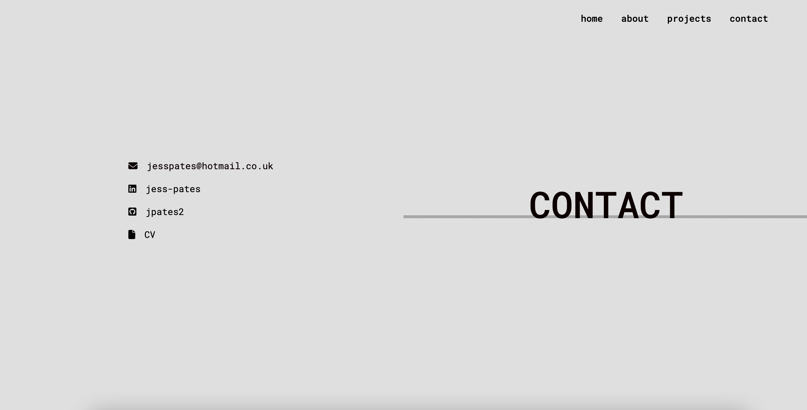

**PROFILE**

Initial version of personal profile page with links to past and current projects.

:round_pushpin: https://myprofile-jpates2.herokuapp.com/

<section>
   
</section>

 
 

<section align=center>
 
 
</section>
